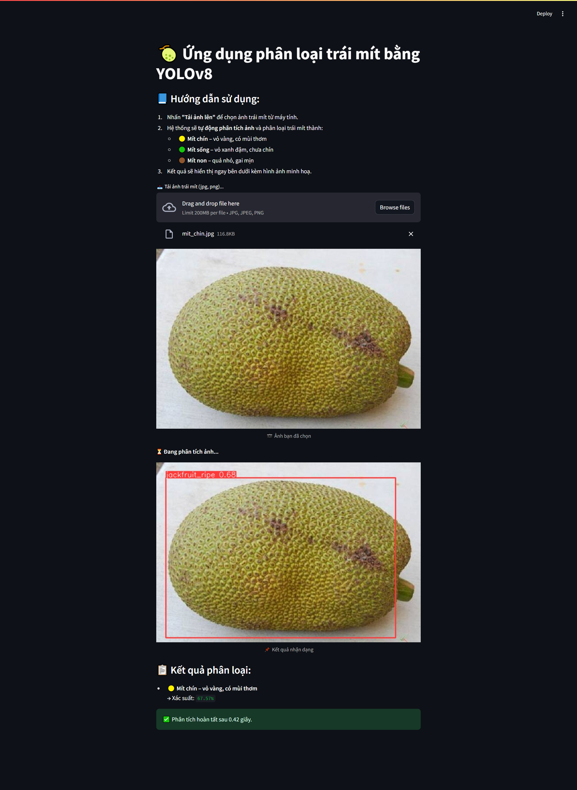
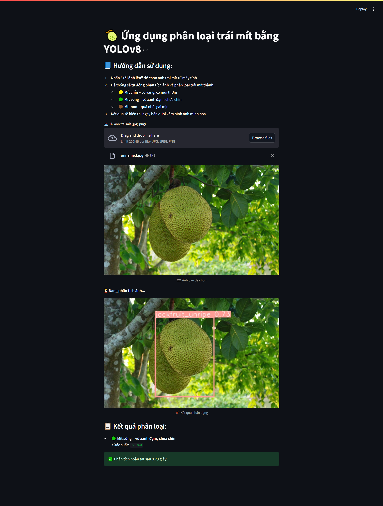
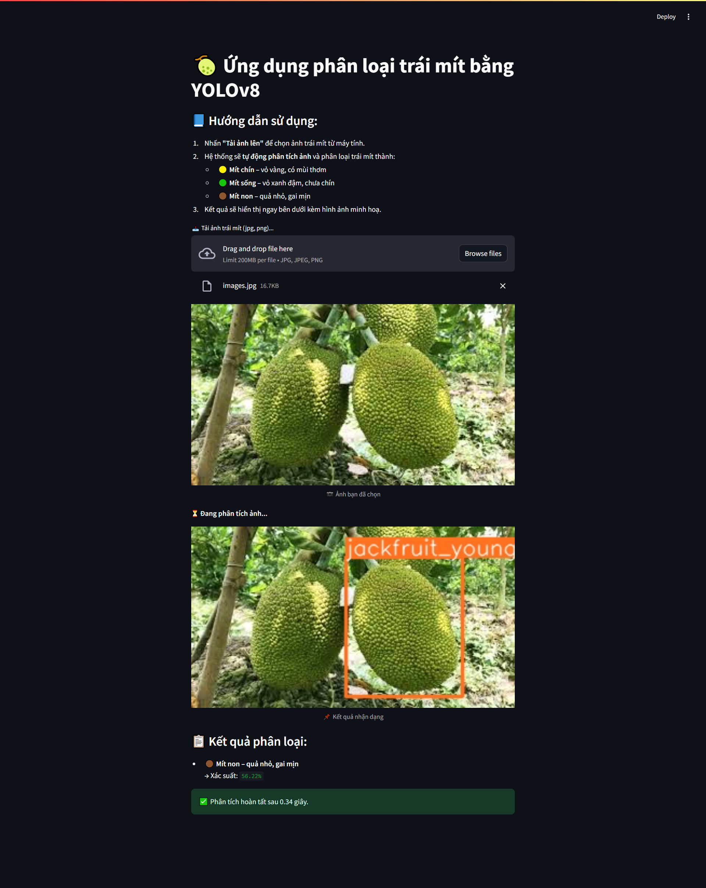

# 🍈 Ứng dụng Phân Loại Trái Mít bằng YOLOv8

## Giới thiệu

Đây là ứng dụng AI sử dụng mô hình YOLOv8 để **phân loại trái mít** dựa trên hình ảnh. Ứng dụng giúp nhận diện và phân biệt các loại mít:

- 🟡 **Mít chín** – vỏ vàng, có mùi thơm  
- 🟢 **Mít sống** – vỏ xanh đậm, chưa chín  
- 🟤 **Mít non** – quả nhỏ, gai mịn

Ứng dụng xây dựng bằng [Streamlit](https://streamlit.io/) với giao diện thân thiện, dễ sử dụng cho mọi đối tượng.

## Tính năng

- Tải ảnh trái mít từ máy tính và nhận kết quả phân loại ngay lập tức.
- Hiển thị ảnh đã nhận diện và nhãn phân loại bằng tiếng Việt.
- Đưa ra xác suất dự đoán cho từng loại mít.

## Hướng dẫn sử dụng

1. Chạy ứng dụng:
    ```bash
    streamlit run app.py
    ```
2. Truy cập địa chỉ hiển thị trên terminal (thường là http://localhost:8501).
3. Tải ảnh trái mít lên và xem kết quả phân loại.

## Minh họa kết quả

### Mít chín


### Mít sống


### Mít non


## Yêu cầu

- Python 3.8+
- Các thư viện: `streamlit`, `ultralytics`, `Pillow`, `torch`, `numpy`

Cài đặt nhanh:
```bash
pip install -r requirements.txt
```

## Cấu trúc dự án

```
jackfruit_classification/
├── app.py
├── best.pt                # File model YOLOv8 đã huấn luyện
├── requirements.txt
└── README.md
```

## Đóng góp

Mọi ý kiến đóng góp hoặc pull request đều được hoan nghênh!

---

**Tác giả:** Nguyễn Văn Duy  
**Liên hệ:** nguyenvanduydev001@gmail.com

